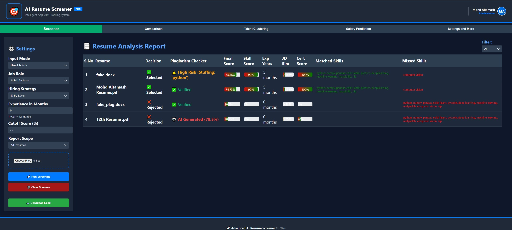
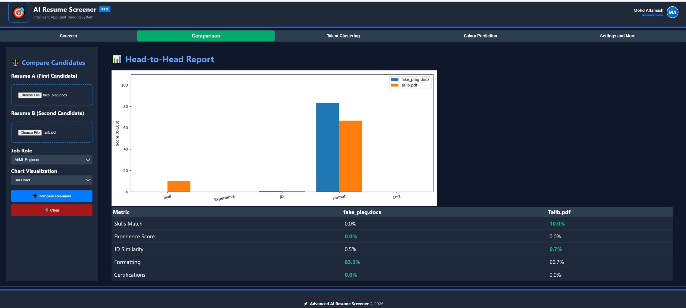
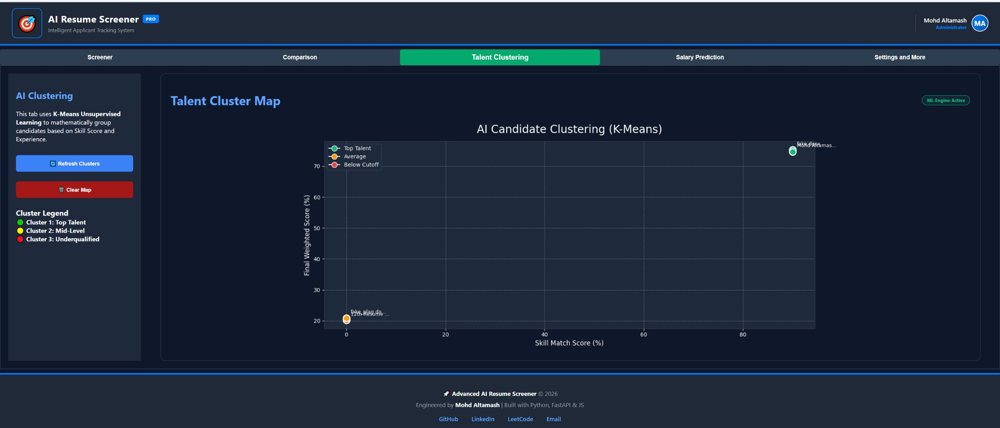
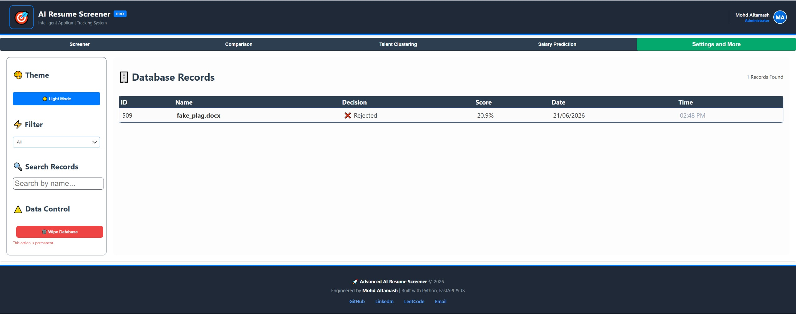

<div align="center">

# 🚀 Advanced AI Resume Screener

### Intelligent Applicant Tracking & Recruitment System

An AI-powered recruitment platform that automatically screens resumes, compares candidates, clusters talent, predicts salaries, and assists recruiters in making data-driven hiring decisions.


</div>

---

# 📌 Project Overview

Advanced AI Resume Screener is an intelligent recruitment platform that automates candidate evaluation and helps recruiters identify the best talent efficiently.

The system analyzes resumes, extracts skills, compares candidates, detects AI-generated content, checks plagiarism, predicts salaries, clusters candidates using machine learning, and stores recruitment records.

---

# ✨ Features

## 📄 Resume Screening

* Multiple resume upload support
* PDF and DOCX support
* Automatic candidate selection
* Resume ranking system
* ATS-style screening
* Custom cutoff scores

---

## 🎯 Skill Analysis

* Skill extraction
* Matched skills detection
* Missing skills analysis
* Experience evaluation
* Certification analysis
* Job description similarity

---

## 🤖 AI Detection

* AI-generated resume detection
* Plagiarism detection
* Keyword stuffing detection

---

## 📊 Candidate Comparison

* Head-to-head candidate comparison
* Skill comparison
* Experience comparison
* Certification comparison
* Graph-based analysis

---

## 🧠 Talent Clustering

* K-Means clustering
* Top talent identification
* Mid-level candidate grouping
* Underqualified candidate detection

---

## 💰 Salary Prediction

* Linear Regression model
* Salary estimation
* Hiring budget calculation
* Multi-candidate budget analysis

---

## 🗄 Database Management

* Screening history storage
* Candidate search
* Filtering system
* Record management

---

# 🛠 Tech Stack

### Backend

* Python
* FastAPI
* SQLite

### Frontend

* HTML
* CSS
* JavaScript

### Machine Learning

* Scikit-Learn
* K-Means Clustering
* Linear Regression

### Data Processing

* Pandas
* NumPy

### Visualization

* Matplotlib

### Deployment

* Vercel
* GitHub

---

# 🧠 Machine Learning Models

| Model                 | Purpose           |
| --------------------- | ----------------- |
| K-Means Clustering    | Talent Clustering |
| Linear Regression     | Salary Prediction |
| Similarity Algorithms | Resume Matching   |
| Weighted Scoring      | Candidate Ranking |

---

# ⚙️ System Workflow

```text
Upload Resume
      ↓
Extract Resume Data
      ↓
Analyze Skills
      ↓
Compare With Job Role
      ↓
Calculate Scores
      ↓
Detect AI & Plagiarism
      ↓
Generate Final Score
      ↓
Select or Reject Candidate
```

---

# 📸 Application Screenshots

## Resume Analysis Dashboard



---

## Candidate Comparison



---

## AI Talent Clustering



---

## Database Records



---

# 📊 Candidate Evaluation Metrics

* Skill Score
* Experience Score
* Job Description Similarity
* Certification Score
* Formatting Score
* AI Detection
* Plagiarism Detection
* Missing Skills Analysis
* Final Weighted Score

---

# 🎯 Use Cases

* HR Departments
* Recruitment Agencies
* Corporate Hiring
* Campus Placement Cells
* Startups
* Talent Acquisition Teams

---

# 🔥 Future Improvements

* Resume Improvement Suggestions
* AI Interview Questions Generator
* Candidate Dashboard
* Recruiter Dashboard
* Email Notifications
* LLM Integration
* Resume Chatbot

---

# 🏆 Key Highlights

✅ Full Stack AI Application

✅ Real-World Recruitment Solution

✅ Machine Learning Integration

✅ Modern Dashboard UI

✅ Data Visualization

✅ Multiple AI Modules

✅ Recruiter-Friendly System

---

# 👨‍💻 Author

## Mohd Altamash

B.Tech Artificial Intelligence & Machine Learning

Aspiring Full Stack AI Engineer

### Connect With Me

* LinkedIn: https://www.linkedin.com/in/mohd-altamash-0997592a6/
* GitHub: https://github.com/altamash8986
* LeetCode: https://leetcode.com/u/altamash007/

---

# ⭐ Support

If you found this project useful, please give it a star on GitHub.

---

# 📜 License

This project is licensed under the MIT License.

---

<div align="center">

### Built with ❤️ using Python, FastAPI, Machine Learning, and JavaScript

</div>

